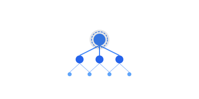

  
  
# PilottAI

<em>Intelligent automation through advanced multi-agent systems</em>

  
  

---

## 🏗️ Framework & Platform

**[PilottAI](https://github.com/pilottai/pilottai)** - Enterprise-grade Python framework for building scalable multi-agent systems  
Built with production orchestration, dynamic scaling, and fault tolerance

**[PilottAI CLI](https://github.com/pilottai/pilottai-cli)** - Developer toolkit for rapid agent development  
Streamlined workflows from prototype to production

## 🎯 Tools & Extensions

**[Agent Marketplace](https://github.com/pilottai/pilottai-agent-marketplace)** - Discover and share specialized AI agents  
Community-driven ecosystem for pre-built solutions

**[PilottAI Interactive](https://github.com/pilottai/pilottai-interactive)** - Visual development environment  
Interactive tools for building and testing agent systems

**[PilottAI Tools](https://github.com/pilottai/pilottai-tools)** - Advanced utilities and integrations  
Extended capabilities for complex use cases

## 📚 Resources & Examples

**[Real-world Applications](https://github.com/pilottai/pilottai-in-industry)** - Industry case studies and production deployments  
See how teams are using PilottAI in production

**[Example Gallery](https://github.com/pilottai/pilottai-examples)** - Ready-to-run implementations  
From simple agents to complex multi-agent workflows

---

### Resources

📖 **[Documentation](https://docs.pilottai.com)** - Complete guides and API reference  
🌐 **[Website](https://pilottai.com)** - Learn about our mission and products  
💬 **[Community](https://discord.com/channels/1351243803536789606)** - Join discussions and get support

### Stay Updated

📢 **[Latest Updates](https://github.com/pilottai/pilottai-announcements)** - News, releases, and roadmap updates
